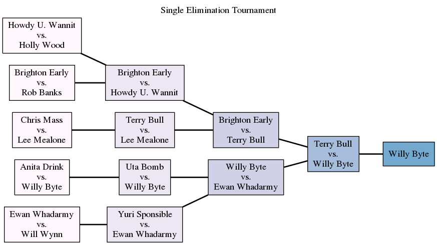

# single_elimination_tournament
[](https://travis-ci.org/nozpheratu/single_elimination_tournament)

A Ruby CLI application for creating single elimination tournaments.

## Requirements
- ruby 2x
- graphviz

## Usage
Simply clone the project, run bundler, and execute the included rake task with a path to line-delimited list of players, sample csvs are
provided in the *sample* folder.
```
rake run[sample/contestants-even.csv]
```
You will then be prompted to provide the outcome for a number of matches depending on how many players were listed in the csv.
```t
Round: 1
1. Chris Mass
2. Yuri Sponsible
?  1
1. Howdy U. Wannit
2. Uta Bomb
?  2
1. Lee Mealone
2. Brighton Early
?  1
1. Rob Banks
2. Ewan Whadarmy
?  2
Round: 2
1. Holly Wood
2. Uta Bomb
?  1
....
```
After each match outcome has been decided, a png, and svg graph will be generated in the *graph* folder depicting the tournament
results.



## Note on byes
This project will automatically determine if byes to be added in order to complete the competition. See [Wikipedia Bye (sports)](https://en.wikipedia.org/wiki/Bye_(sports))
for more details.

